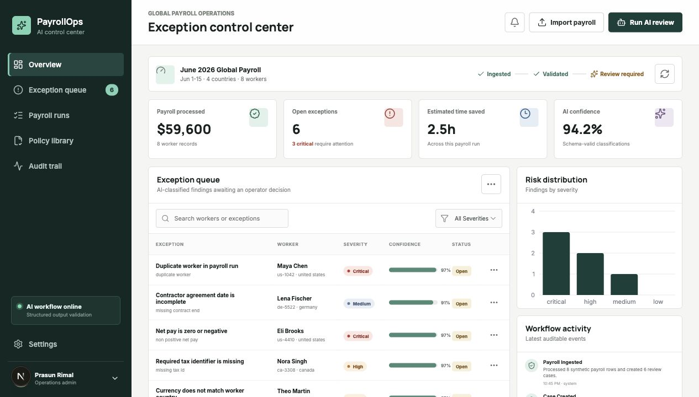
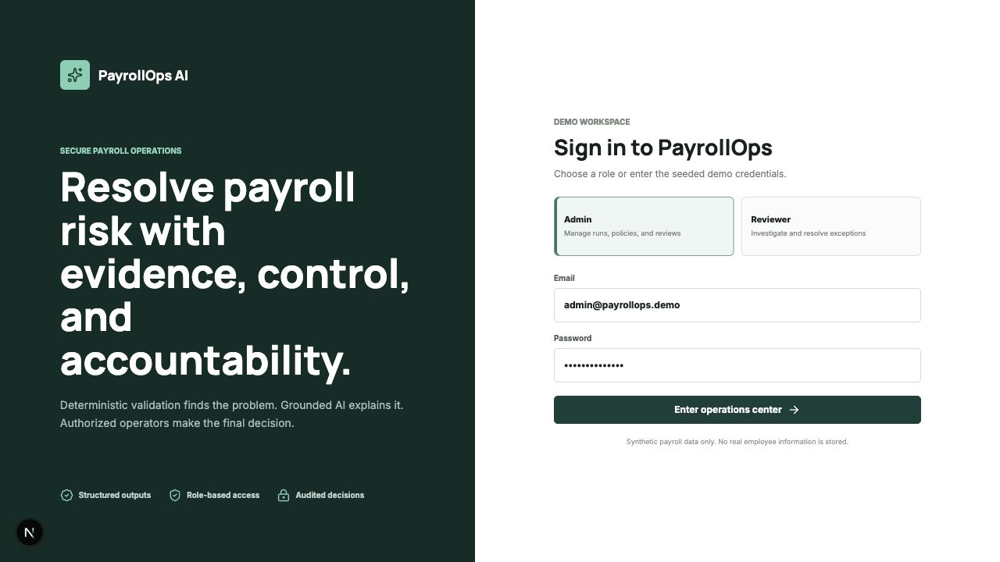
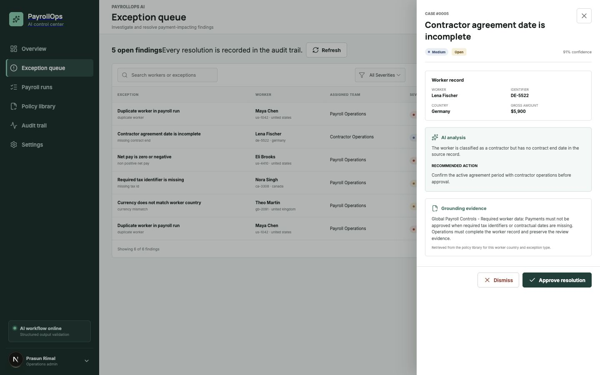
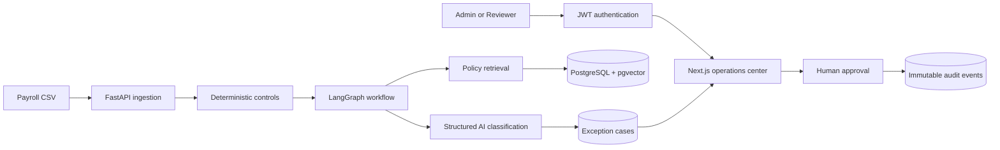

# PayrollOps AI

AI-assisted payroll exception operations for internal finance and people teams. PayrollOps ingests payroll CSV files, applies deterministic controls, retrieves relevant policy evidence, classifies exceptions through a structured multi-step AI workflow, and routes every payment-impacting decision through human review.

> This repository uses fictional workers and synthetic payroll data. It is an engineering demonstration, not payroll, tax, or legal advice.



<details>
<summary><strong>Role-based demo login</strong></summary>



</details>

<details>
<summary><strong>Case review with grounded AI analysis</strong></summary>



</details>

## Why this project exists

Payroll teams reconcile large, country-specific datasets under tight deadlines. A missed duplicate, currency mismatch, incomplete worker record, or unusual deduction can become an expensive payment incident. PayrollOps combines deterministic validation with grounded AI analysis while preserving the operator as the final decision-maker.

## Product capabilities

- Import and validate payroll CSV files across multiple countries.
- Authenticate persisted users with Argon2 password hashing and signed JWT sessions.
- Enforce Admin and Reviewer permissions across backend endpoints and frontend controls.
- Detect duplicate workers, currency mismatches, missing tax data, non-positive pay, and incomplete contractor agreements.
- Orchestrate retrieval and classification as a LangGraph workflow.
- Ground explanations in a country-aware policy library.
- Enforce Pydantic-validated structured model outputs.
- Store embeddings in PostgreSQL with `pgvector`; use a deterministic local vector fallback for zero-cost demos.
- Approve or dismiss findings through a human review queue.
- Preserve case creation, status changes, and AI review runs in an audit trail.
- Run fully without an API key in deterministic mock mode.

## Architecture



## Technology

**Frontend:** Next.js 16, React 19, TypeScript, Recharts, Lucide icons  
**Backend:** Python 3.12, FastAPI, SQLAlchemy, Pydantic, LangGraph  
**AI:** OpenAI Responses API structured outputs and embeddings  
**Data:** PostgreSQL, pgvector, SQLite local fallback  
**Security:** Argon2 password hashing, JWT sessions, role-based authorization
**Operations:** Docker Compose, Pytest, Vercel/Render-ready configuration

## Run locally

### Fast local demo

The default mode uses SQLite and deterministic AI responses, so no external services or API key are required.

```bash
cd backend
python3.12 -m venv .venv
source .venv/bin/activate
pip install -e ".[dev]"
uvicorn app.main:app --reload
```

In a second terminal:

```bash
cd frontend
npm install
cp .env.example .env.local
npm run dev
```

Open `http://localhost:3000`.

Use either seeded demo account:

| Role | Email | Password |
| --- | --- | --- |
| Admin | `admin@payrollops.demo` | `DemoAdmin!2026` |
| Reviewer | `reviewer@payrollops.demo` | `DemoReviewer!2026` |

Admin users can import payroll runs and create policy sections. Both roles can inspect and resolve exceptions; the authenticated user is recorded automatically in the audit trail.

### Docker + PostgreSQL + pgvector

```bash
docker compose up --build
```

The frontend runs on `http://localhost:3000`, the API on `http://localhost:8000`, and interactive API documentation on `http://localhost:8000/docs`.

## Enable real OpenAI analysis

Create `backend/.env` without placing the secret in source control:

```bash
cd backend
read -s "OPENAI_API_KEY?OpenAI API key: " OPENAI_API_KEY
printf "OPENAI_API_KEY=%s\nAI_PROVIDER=openai\n" "$OPENAI_API_KEY" > .env
unset OPENAI_API_KEY
```

The application uses structured outputs for exception analysis and `text-embedding-3-small` for policy retrieval. Mock mode remains the recommended setting for public demos because it is deterministic and incurs no API cost.

## Import format

Use [sample-data/payroll-demo.csv](sample-data/payroll-demo.csv) as a template. Required columns:

```text
worker_id,worker_name,country,currency,gross_pay,net_pay,tax_id,contractor,contract_end_date
```

All included names, identifiers, and amounts are fictional.

## Quality checks

```bash
cd backend && .venv/bin/pytest --cov=app
cd frontend && npm run build
```

The backend suite covers ingestion validation, seeded workflow execution, dashboard responses, policy retrieval, system configuration, and case status transitions.

## Repository layout

```text
backend/       FastAPI API, LangGraph workflow, retrieval, models, tests
frontend/      Next.js operations dashboard
sample-data/   Synthetic CSV for import demonstrations
docker-compose.yml
```

## Responsible AI design

- Deterministic rules identify candidate exceptions before the LLM is called.
- Model responses must match a strict Pydantic schema.
- Retrieved policy text is supplied as bounded grounding context.
- Confidence is visible to operators rather than treated as certainty.
- Payment-impacting actions require explicit human approval.
- Backend authorization prevents Reviewer accounts from performing Admin operations.
- Audit events record system and operator decisions.

## Author

Built by [Prasun Rimal](https://prasun-rimal.github.io) · [GitHub](https://github.com/prasun-rimal) · [LinkedIn](https://linkedin.com/in/prasunrimal)
